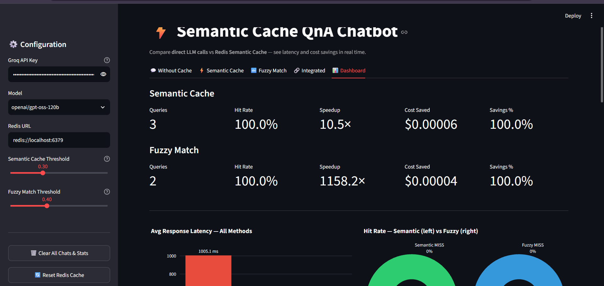
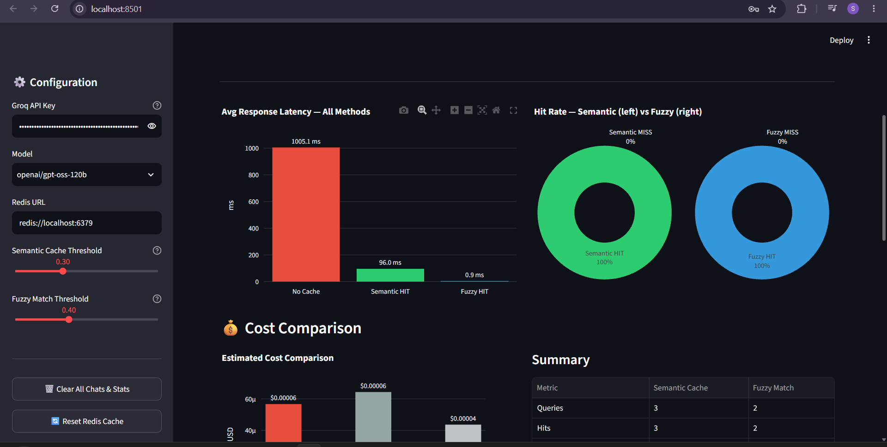
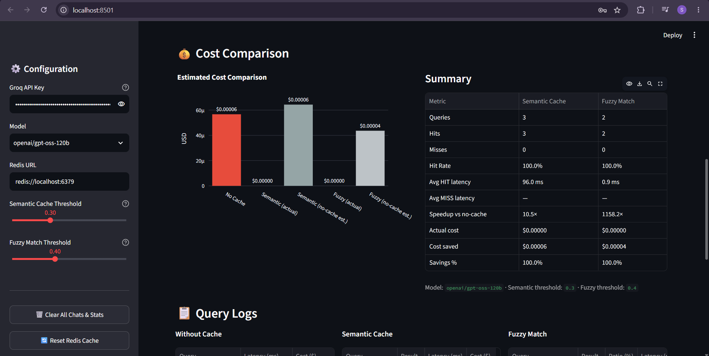
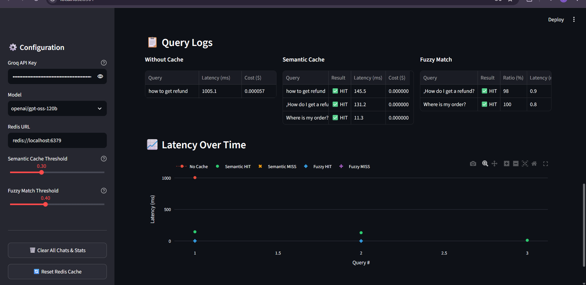

# Semantic Cache Q&A Chatbot

A Streamlit-based customer support Q&A chatbot that uses **Redis Semantic Cache** to reuse responses for semantically similar queries and reduce unnecessary LLM calls.

The project compares **Direct LLM**, **Semantic Cache**, **Fuzzy Matching**, and an **Integrated Cache Pipeline**, while providing a dashboard for monitoring latency, cache hits, estimated cost, and performance.

---

## 📸 Application Preview





---

## Features

### 1.Direct LLM Mode

Sends every user query directly to the Groq LLM without using any cache.

This mode acts as the baseline for comparing:

- Response latency
- LLM calls
- Estimated cost
- Cache performance

### 2. Redis Semantic Cache

Uses Redis Semantic Cache to identify previously answered questions that are semantically similar to the current query.

For example:

```text
"What is your refund policy?"
"How can I get a refund?"
"Can I receive my money back?"

These queries can have similar meanings even though the wording is different.

If a sufficiently similar query already exists in the cache, the stored response is returned without calling the LLM again.

3. Fuzzy Matching

Uses fuzzy string matching to identify queries that are textually similar.

This provides another lightweight caching approach for comparison with semantic similarity.

4.  Integrated Cache

Combines the caching approaches into a single pipeline:

User Query
    ↓
Semantic Cache
    ↓
Fuzzy Matching
    ↓
LLM Fallback
    ↓
Store Response

The LLM is used only when an appropriate cached response cannot be found.

5. 📊 Performance Dashboard

The dashboard tracks:

Total queries
Cache hits
Cache misses
Cache hit rate
Average response latency
LLM calls
Estimated cost
Cost savings
Speedup
Semantic Cache performance
Fuzzy Cache performance
6. 📚 FAQ Seed Data

The application can preload frequently asked questions and their responses into the semantic cache.

This makes it possible to demonstrate cache hits immediately after starting the application.

🏗️ System Architecture
                    ┌─────────────────┐
                    │    User Query   │
                    └────────┬────────┘
                             │
                             ▼
                ┌────────────────────────┐
                │   Redis Semantic Cache │
                │   + Embeddings         │
                └────────────┬───────────┘
                             │
                  ┌──────────┴──────────┐
                  │                     │
                HIT                   MISS
                  │                     │
                  ▼                     ▼
          ┌──────────────┐    ┌─────────────────┐
          │ Cached Answer│    │ Fuzzy Matching  │
          └──────────────┘    └────────┬────────┘
                                       │
                             ┌─────────┴─────────┐
                             │                   │
                           MATCH               NO MATCH
                             │                   │
                             ▼                   ▼
                       ┌──────────────┐   ┌──────────────┐
                       │Cached Answer │   │   Groq LLM   │
                       └──────────────┘   └──────┬───────┘
                                                 │
                                                 ▼
                                         ┌──────────────┐
                                         │ Store Result │
                                         │ in Cache     │
                                         └──────────────┘
🔄 How It Works
Without Cache
User Query
    ↓
Groq LLM
    ↓
Response

Every query results in an LLM call.

Semantic Cache
User Query
    ↓
Generate Embedding
    ↓
Search Redis Semantic Cache
    ↓
Similarity Match
    ↓
 ┌───────────────┐
 │               │
 HIT            MISS
 │               │
 ▼               ▼
Cached Answer   Groq LLM
                ↓
           Store Response
Fuzzy Cache
User Query
    ↓
Fuzzy Similarity
    ↓
 ┌───────────────┐
 │               │
MATCH          NO MATCH
 │               │
 ▼               ▼
Cached Answer   Groq LLM
Integrated Mode

The integrated mode combines caching approaches before falling back to the LLM.

User Query
    ↓
Semantic Cache
    ↓
Fuzzy Matching
    ↓
LLM Fallback
    ↓
Store Response
🧠 Semantic Caching

Semantic caching stores previous questions and answers and retrieves them based on meaning, rather than requiring an exact text match.

For example:

Original Query:
"What is the refund policy?"

New Query:
"How do I request a refund?"

Although the text is different, the semantic meaning can be similar.

The application generates embeddings for the query and compares them with cached embeddings.

A configurable similarity threshold determines whether the cached response should be reused.

📈 Performance Monitoring

The application provides analytics for comparing different approaches.

Metrics
Metric	Description
Total Queries	Number of queries processed
Cache Hits	Queries answered from cache
Cache Misses	Queries requiring further processing
Hit Rate	Percentage of queries served from cache
Average Latency	Average response time
LLM Calls	Number of calls made to the LLM
Estimated Cost	Estimated LLM usage cost
Cost Saved	Estimated cost avoided through caching
Speedup	Relative latency improvement

The dashboard allows comparison between:

No Cache
    ↓
Semantic Cache
    ↓
Fuzzy Cache
    ↓
Integrated Cache
🛠️ Tech Stack
Programming Language
Python
Frontend
Streamlit
LLM
Groq
LangChain
Caching
Redis
Redis Semantic Cache
RedisVL
Fuzzy Matching
Embeddings
Hugging Face Embeddings
Data & Visualization
Pandas
Plotly
Infrastructure
Docker
Redis Docker Container
Development
Git
GitHub
Jupyter Notebook
📁 Project Structure
semantic-cache-qna-chatbot/
│
├── app.py
├── main.py
├── README.md
├── pyproject.toml
├── uv.lock
├── .python-version
├── .gitignore
│
├── data/
│   ├── benchmark.csv
│   └── faq_seed.csv
│
├── notebooks/
│   ├── evals.py
│   ├── fuzzy.ipynb
│   └── test.ipynb
│
└── docs/
    └── semantic-cache-dashboard.png

API keys and local secrets should never be committed to GitHub.

⚙️ Configuration

The application requires a Groq API key.

The API key should be stored securely using Streamlit secrets or an environment variable.

Example:

GROQ_API_KEY = "your-api-key"

Do not hard-code real API keys in source code or notebooks.

Recommended files to keep out of Git:

.env
.streamlit/secrets.toml
streamlit/secrets.toml

The application also uses Redis.

Default Redis URL:

redis://localhost:6379
🗄️ Redis Setup

Redis can be run locally using Docker.

Pull Redis Image
docker pull redis
Start Redis
docker run -d --name redis-cache -p 6379:6379 redis
Check Running Container
docker ps

Redis should be available at:

redis://localhost:6379
▶️ Installation

Clone the repository:

git clone https://github.com/Sasiya-Elangovan/semantic-cache-qna-chatbot.git

Move into the project directory:

cd semantic-cache-qna-chatbot

Install dependencies:

uv sync

If you are using pip instead:

pip install -r requirements.txt
🚀 Running the Application

Start Redis:

docker start redis-cache

Then start Streamlit:

streamlit run app.py

The application will open at:

http://localhost:8501
🎛️ Application Modes

The application contains five main sections.

💬 Without Cache

Runs every query directly through the LLM.

Used as the baseline.

⚡ Semantic Cache

Uses Redis semantic similarity to reuse previous responses.

🔤 Fuzzy Match

Uses fuzzy string matching to identify similar queries.

🔗 Integrated

Combines semantic caching, fuzzy matching, and LLM fallback.

📊 Dashboard

Displays performance statistics and comparisons.

🧪 Benchmarking

The project includes benchmark data and notebooks for evaluating cache performance.

The benchmarking process can compare:

Direct LLM
     ↓
Semantic Cache
     ↓
Fuzzy Cache
     ↓
Integrated Cache

Important metrics include:

Average latency
Cache hit rate
Cache miss rate
Number of LLM calls
Estimated cost
Cost savings
Speedup

Benchmark results depend on factors such as:

LLM model
Query workload
Number of queries
Cache state
Embedding model
Redis performance
Network latency
Similarity thresholds

Therefore, benchmark results should always be reported together with the conditions under which they were measured.

📊 Benchmark Dataset

The project contains:

data/benchmark.csv

This dataset can be used to evaluate different caching strategies under a controlled workload.

FAQ data is available in:

data/faq_seed.csv
💡 Use Cases

Semantic caching can be useful in applications where users frequently ask similar questions.

Examples include:

Customer support chatbots
FAQ assistants
E-commerce support
Banking support systems
Documentation assistants
Internal enterprise assistants
Knowledge-base chatbots
Helpdesk systems

Caching repeated or semantically similar queries can reduce unnecessary LLM requests and improve response efficiency.

🔐 Security

Never commit API keys or credentials to GitHub.

Use environment variables or Streamlit secrets.

For example:

import os

api_key = os.getenv("GROQ_API_KEY")

or Streamlit secrets:

import streamlit as st

api_key = st.secrets["GROQ_API_KEY"]

Always add secret files to .gitignore.

👩‍💻 Author

Sasiya Elangovan

B.E. Computer Science and Engineering
RMK Engineering College

GitHub:
https://github.com/Sasiya-Elangovan

📄 License

This project is intended for educational, learning, and portfolio purposes.